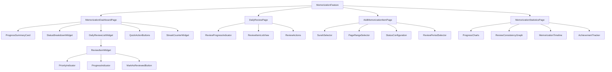

# Quran Memorization Tracking Feature Design

## Document Version

- Version: 1.0
- Last Updated: May 22, 2024
- Author: Qoder AI Assistant

## 1. Overview

This document outlines the design for a new Quran memorization tracking feature to be integrated into the SunnahTrack application. The feature will help users systematically memorize and review the Quran using an intelligent review and assessment mechanism.

The design follows the existing Clean Architecture pattern used throughout the SunnahTrack application, with clear separation between domain, data, and presentation layers.

### 1.1 Purpose and Goals

The Quran Memorization Tracking feature aims to:
1. Help users systematically memorize the Quran
2. Provide an intelligent review system based on spaced repetition principles
3. Track progress and provide motivation through statistics and achievements
4. Integrate seamlessly with the existing SunnahTrack application

### 1.2 Scope

This feature will include:
- Memorization item management (add, update, delete)
- Daily review system with priority management
- Progress tracking and statistics
- Integration with existing app infrastructure

### 1.3 Key Features

1. **Three-Status Memorization System**
   - New: Recently added items
   - InProgress: Items being actively memorized (0-4 consecutive review days)
   - Memorized: Items with 5+ consecutive review days

2. **Intelligent Review Scheduling**
   - Priority-based review for InProgress items (oldest first)
   - Cyclical review for Memorized items (based on user-selected period)
   - Consecutive day tracking with reset mechanism

3. **Progress Tracking**
   - Visual progress indicators
   - Statistics and charts
   - Achievement system
   - Review streak tracking

## 2. Architecture

The feature will follow the existing Clean Architecture pattern used throughout the SunnahTrack application, with clear separation between domain, data, and presentation layers. This approach ensures testability, maintainability, and scalability.

### 2.1 Domain Layer
The domain layer contains the business logic and entities that represent the core concepts of the memorization tracking feature.

**Entities:**
- `MemorizationItem`: Represents a surah or part being memorized
- `MemorizationStatus`: Enum defining the status of memorization items
- `ReviewSchedule`: Defines when items should be reviewed

**Use Cases:**
- `AddMemorizationItem`: Adds a new item to track
- `UpdateMemorizationStatus`: Updates the status of an item
- `GetDailyReviewItems`: Retrieves items that need to be reviewed today
- `GetMemorizationStatistics`: Provides statistical data about memorization progress
- `GetMemorizationProgress`: Calculates overall memorization progress
- `MarkItemAsReviewed`: Marks an item as reviewed for the day
- `GetReviewStreak`: Retrieves the current review streak

**Repository Interface:**
- `MemorizationRepository`: Abstract interface for data operations

### 2.2 Data Layer
The data layer implements the repository interface and handles data persistence.

**Repository Implementation:**
- `MemorizationRepositoryImpl`: Implements the repository interface using local data sources

**Data Sources:**
- `MemorizationLocalDataSource`: Handles local data storage using SharedPreferences

**Models:**
- `MemorizationItemModel`: Data model that extends the domain entity with serialization methods
- `ReviewHistoryModel`: Model for storing review history data

### 2.3 Presentation Layer
The presentation layer handles the UI and user interaction using the BLoC pattern.

**State Management:**
- `MemorizationBloc`: Manages the state of the memorization feature
- `MemorizationEvent`: Events that trigger state changes
- `MemorizationState`: States that represent the UI state

**Pages:**
- `MemorizationDashboardPage`: Main dashboard showing progress and daily reviews
- `AddMemorizationItemPage`: Page for adding new items to memorize
- `DailyReviewPage`: Page for completing daily reviews
- `MemorizationStatisticsPage`: Page showing detailed statistics

**Widgets:**
- `MemorizationProgressWidget`: Visual indicator of overall progress
- `DailyReviewItemWidget`: Widget for displaying individual review items
- `MemorizationStatusChart`: Chart showing status distribution
- `ReviewStreakWidget`: Widget showing current review streak

### 2.4 Integration with Existing Features
The memorization tracking feature will integrate seamlessly with existing SunnahTrack infrastructure:

- **Dependency Injection**: Uses the existing GetIt system for service location
- **State Management**: Follows the BLoC pattern consistent with other features
- **Theming**: Integrates with the existing theme system for consistent UI
- **Localization**: Uses the existing localization system for multi-language support
- **Quran Integration**: Leverages the existing QuranLibrary for surah information
- **Shared Utilities**: Uses common services like SharedPrefService and NotificationService
- **Error Handling**: Follows the existing Either/Failure pattern for consistent error handling

## 3. Data Models

### 3.1 MemorizationItem Entity
```dart
class MemorizationItem extends Equatable {
  /// Unique identifier for the memorization item
  final int id;

  /// Surah number (1-114) or 0 for non-surah parts
  final int surahNumber;

  /// Name of the surah or part
  final String surahName;

  /// Starting page number in the Quran
  final int startPage;

  /// Ending page number in the Quran
  final int endPage;

  /// Date when the item was added for memorization
  final DateTime dateAdded;

  /// Current status of memorization
  final MemorizationStatus status;

  /// Number of consecutive days the item has been reviewed
  /// Ranges from 0-5 for tracking progress to "Memorized" status
  final int consecutiveReviewDays;

  /// Timestamp of the last review
  final DateTime? lastReviewed;

  /// History of all review timestamps
  final List<DateTime> reviewHistory;

  /// Constructor
  const MemorizationItem({
    required this.id,
    required this.surahNumber,
    required this.surahName,
    required this.startPage,
    required this.endPage,
    required this.dateAdded,
    required this.status,
    required this.consecutiveReviewDays,
    required this.lastReviewed,
    required this.reviewHistory,
  });

  @override
  List<Object?> get props => [
    id,
    surahNumber,
    surahName,
    startPage,
    endPage,
    dateAdded,
    status,
    consecutiveReviewDays,
    lastReviewed,
    reviewHistory,
  ];

  /// Creates a copy of this item with specified fields replaced
  MemorizationItem copyWith({
    int? id,
    int? surahNumber,
    String? surahName,
    int? startPage,
    int? endPage,
    DateTime? dateAdded,
    MemorizationStatus? status,
    int? consecutiveReviewDays,
    DateTime? lastReviewed,
    List<DateTime>? reviewHistory,
  }) {
    return MemorizationItem(
      id: id ?? this.id,
      surahNumber: surahNumber ?? this.surahNumber,
      surahName: surahName ?? this.surahName,
      startPage: startPage ?? this.startPage,
      endPage: endPage ?? this.endPage,
      dateAdded: dateAdded ?? this.dateAdded,
      status: status ?? this.status,
      consecutiveReviewDays: consecutiveReviewDays ?? this.consecutiveReviewDays,
      lastReviewed: lastReviewed ?? this.lastReviewed,
      reviewHistory: reviewHistory ?? this.reviewHistory,
    );
  }

  /// Calculates the total number of pages in this memorization item
  int get pageCount => endPage - startPage + 1;

  /// Determines if this item is due for review today
  bool isDueForReview(int reviewPeriod) {
    if (status != MemorizationStatus.memorized) return false;
    if (lastReviewed == null) return true;

    // Calculate which group this item belongs to
    final itemGroup = id % reviewPeriod;

    // Calculate which group should be reviewed today
    final dayInCycle = DateTime.now().weekday % reviewPeriod;

    return itemGroup == dayInCycle;
  }
}
```

### 3.2 MemorizationStatus Enum
```dart
enum MemorizationStatus {
  /// Newly added item that has not been reviewed yet
  new,

  /// Item being actively memorized (0-4 consecutive review days)
  inProgress,

  /// Item that has been successfully memorized (5+ consecutive review days)
  memorized,

  /// Memorized item that has been paused or archived
  archived
}
```

### 3.3 ReviewSchedule Entity
```dart
class ReviewSchedule extends Equatable {
  /// User-selected review period in days (5, 6, or 7)
  final int reviewPeriodDays;

  /// Items scheduled for review today
  final List<MemorizationItem> dailyItems;

  /// Constructor
  const ReviewSchedule({
    required this.reviewPeriodDays,
    required this.dailyItems,
  });

  @override
  List<Object?> get props => [reviewPeriodDays, dailyItems];

  /// Calculates the total number of items scheduled for today
  int get dailyItemCount => dailyItems.length;

  /// Calculates the number of in-progress items in today's schedule
  int get inProgressItemCount => dailyItems
      .where((item) => item.status == MemorizationStatus.inProgress)
      .length;

  /// Calculates the number of memorized items in today's schedule
  int get memorizedItemCount => dailyItems
      .where((item) => item.status == MemorizationStatus.memorized)
      .length;
}
```

## 4. Core Functionality

### 4.1 Memorization Tracking Algorithm

#### 4.1.1 Status Management
1. **New**: When a surah/part is first added
2. **InProgress**: After 1-4 consecutive daily reviews
3. **Memorized**: After 5 consecutive daily reviews
4. **Archived**: Memorized items that have been paused or completed

#### 4.1.2 Review Logic
- Items in "InProgress" status must be reviewed daily to maintain consecutive count
- If a day is missed, consecutive count resets to 1 (not 0, to maintain progress)
- "Memorized" items are scheduled for review based on the user's selected review period (5/6/7 days)
- Missed reviews for memorized items are tracked but don't reset the consecutive count

#### 4.1.3 Priority Management
- "InProgress" items are prioritized by date added (oldest first)
- "Memorized" items are scheduled cyclically based on review period
- Daily review list shows highest priority items first

### 4.2 Review Cycle Calculation

For memorized items, the review cycle works as follows:
1. When an item becomes "Memorized", it's assigned to a review group based on its ID
2. Items are divided into N groups where N equals the user's selected review period (5, 6, or 7)
3. Each day, one group is scheduled for review
4. The cycle repeats continuously

Example with 20 memorized items and 5-day review period:
- Group 0: Items with ID % 5 = 0 (reviewed on Day 1)
- Group 1: Items with ID % 5 = 1 (reviewed on Day 2)
- Group 2: Items with ID % 5 = 2 (reviewed on Day 3)
- Group 3: Items with ID % 5 = 3 (reviewed on Day 4)
- Group 4: Items with ID % 5 = 4 (reviewed on Day 5)
- Cycle repeats

### 4.3 Daily Review System
- Prioritizes "InProgress" items (oldest first)
- Schedules "Memorized" items based on review cycle
- Tracks completion and updates status accordingly
- Provides reminders for missed reviews

### 4.4 Progress Tracking
- Calculates percentage of Quran memorized based on pages
- Tracks number of "Memorized" items
- Shows streak of consecutive review days
- Provides statistics on review consistency
- Calculates estimated completion dates

### 4.5 Notification System
- Sends daily reminders for reviews
- Provides gentle notifications for missed reviews
- Allows users to customize notification timing
- Integrates with existing notification service

## 5. Data Storage

Since this is a local-only feature, all data is stored locally using SharedPreferences, following the existing data storage patterns in SunnahTrack. This approach ensures fast access, offline availability, and consistency with other app features.

### 5.1 Storage Structure

The data is organized in SharedPreferences with the following keys:

- `memorization_items`: JSON string containing a list of all memorization items
- `review_history`: JSON string containing history of completed reviews
- `user_preferences`: JSON string containing user settings (review period, memorization direction)
- `statistics`: JSON string containing pre-calculated statistics for performance optimization
- `last_review_date`: String representation of the last review date for streak calculation

### 5.2 Data Access Layer

The data access layer follows the repository pattern used throughout SunnahTrack:

```dart
class MemorizationLocalDataSource {
  final SharedPreferences sharedPreferences;
  
  // Keys for SharedPreferences
  static const String _itemsKey = 'memorization_items';
  static const String _historyKey = 'review_history';
  static const String _preferencesKey = 'user_preferences';
  static const String _statisticsKey = 'statistics';
  static const String _lastReviewDateKey = 'last_review_date';
  
  const MemorizationLocalDataSource({required this.sharedPreferences});
  
  /// Retrieves all memorization items from storage
  Future<List<MemorizationItemModel>> getAllItems() async {
    try {
      final itemsJson = sharedPreferences.getString(_itemsKey);
      if (itemsJson == null) return [];
      
      final List<dynamic> itemsList = json.decode(itemsJson);
      return itemsList
          .map((json) => MemorizationItemModel.fromJson(json))
          .toList();
    } catch (e) {
      // Handle parsing errors
      return [];
    }
  }
  
  /// Saves all memorization items to storage
  Future<void> saveAllItems(List<MemorizationItemModel> items) async {
    final itemsJson = json.encode(items.map((item) => item.toJson()).toList());
    await sharedPreferences.setString(_itemsKey, itemsJson);
  }
  
  /// Adds a new memorization item
  Future<MemorizationItemModel> addItem(MemorizationItemModel item) async {
    final items = await getAllItems();
    items.add(item);
    await saveAllItems(items);
    return item;
  }
  
  /// Updates an existing memorization item
  Future<MemorizationItemModel> updateItem(MemorizationItemModel updatedItem) async {
    final items = await getAllItems();
    final index = items.indexWhere((item) => item.id == updatedItem.id);
    if (index != -1) {
      items[index] = updatedItem;
      await saveAllItems(items);
    }
    return updatedItem;
  }
  
  /// Removes a memorization item
  Future<void> removeItem(int id) async {
    final items = await getAllItems();
    items.removeWhere((item) => item.id == id);
    await saveAllItems(items);
  }
  
  /// Gets user preferences
  Future<MemorizationPreferences> getPreferences() async {
    try {
      final prefsJson = sharedPreferences.getString(_preferencesKey);
      if (prefsJson == null) {
        // Return default preferences
        return const MemorizationPreferences(
          reviewPeriod: 5,
          memorizationDirection: MemorizationDirection.fromBaqarah,
        );
      }
      
      final json = json.decode(prefsJson);
      return MemorizationPreferences.fromJson(json);
    } catch (e) {
      // Return default preferences on error
      return const MemorizationPreferences(
        reviewPeriod: 5,
        memorizationDirection: MemorizationDirection.fromBaqarah,
      );
    }
  }
  
  /// Saves user preferences
  Future<void> savePreferences(MemorizationPreferences preferences) async {
    final prefsJson = json.encode(preferences.toJson());
    await sharedPreferences.setString(_preferencesKey, prefsJson);
  }
}
```

### 5.3 Data Models for Storage

#### MemorizationItemModel
Extends the domain entity with JSON serialization methods:

```dart
class MemorizationItemModel extends MemorizationItem {
  // Constructor
  const MemorizationItemModel({
    required super.id,
    required super.surahNumber,
    required super.surahName,
    required super.startPage,
    required super.endPage,
    required super.dateAdded,
    required super.status,
    required super.consecutiveReviewDays,
    required super.lastReviewed,
    required super.reviewHistory,
  });
  
  // Factory method to create from JSON
  factory MemorizationItemModel.fromJson(Map<String, dynamic> json) {
    return MemorizationItemModel(
      id: json['id'] as int,
      surahNumber: json['surahNumber'] as int,
      surahName: json['surahName'] as String,
      startPage: json['startPage'] as int,
      endPage: json['endPage'] as int,
      dateAdded: DateTime.parse(json['dateAdded'] as String),
      status: MemorizationStatus.values.firstWhere(
        (e) => e.toString() == json['status'],
        orElse: () => MemorizationStatus.new,
      ),
      consecutiveReviewDays: json['consecutiveReviewDays'] as int,
      lastReviewed: json['lastReviewed'] != null 
        ? DateTime.parse(json['lastReviewed'] as String)
        : null,
      reviewHistory: (json['reviewHistory'] as List<dynamic>?)
        ?.map((e) => DateTime.parse(e as String))
        .toList() ?? [],
    );
  }
  
  // Method to convert to JSON
  Map<String, dynamic> toJson() {
    return {
      'id': id,
      'surahNumber': surahNumber,
      'surahName': surahName,
      'startPage': startPage,
      'endPage': endPage,
      'dateAdded': dateAdded.toIso8601String(),
      'status': status.toString(),
      'consecutiveReviewDays': consecutiveReviewDays,
      'lastReviewed': lastReviewed?.toIso8601String(),
      'reviewHistory': reviewHistory.map((e) => e.toIso8601String()).toList(),
    };
  }
  
  /// Creates a domain entity from this model
  MemorizationItem toEntity() {
    return MemorizationItem(
      id: id,
      surahNumber: surahNumber,
      surahName: surahName,
      startPage: startPage,
      endPage: endPage,
      dateAdded: dateAdded,
      status: status,
      consecutiveReviewDays: consecutiveReviewDays,
      lastReviewed: lastReviewed,
      reviewHistory: reviewHistory,
    );
  }
}
```

#### MemorizationPreferences Model

```dart
class MemorizationPreferences extends Equatable {
  /// User-selected review period in days (5, 6, or 7)
  final int reviewPeriod;
  
  /// Direction of memorization (from Al-Baqarah or An-Nas)
  final MemorizationDirection memorizationDirection;
  
  /// Constructor
  const MemorizationPreferences({
    required this.reviewPeriod,
    required this.memorizationDirection,
  });
  
  @override
  List<Object?> get props => [reviewPeriod, memorizationDirection];
  
  /// Creates a copy with specified fields replaced
  MemorizationPreferences copyWith({
    int? reviewPeriod,
    MemorizationDirection? memorizationDirection,
  }) {
    return MemorizationPreferences(
      reviewPeriod: reviewPeriod ?? this.reviewPeriod,
      memorizationDirection: memorizationDirection ?? this.memorizationDirection,
    );
  }
  
  /// Factory method to create from JSON
  factory MemorizationPreferences.fromJson(Map<String, dynamic> json) {
    return MemorizationPreferences(
      reviewPeriod: json['reviewPeriod'] as int,
      memorizationDirection: MemorizationDirection.values.firstWhere(
        (e) => e.toString() == json['memorizationDirection'],
        orElse: () => MemorizationDirection.fromBaqarah,
      ),
    );
  }
  
  /// Method to convert to JSON
  Map<String, dynamic> toJson() {
    return {
      'reviewPeriod': reviewPeriod,
      'memorizationDirection': memorizationDirection.toString(),
    };
  }
}

enum MemorizationDirection {
  fromBaqarah,
  fromNas,
}
```

## 6. Business Logic Layer

### 6.1 Core Use Cases

The use cases follow the existing pattern in SunnahTrack, implementing the UseCase interface with Either<Failure, T> return types for consistent error handling.

#### AddMemorizationItem
- **Purpose**: Adds a new surah/part to memorization tracking
- **Parameters**: `AddMemorizationItemParams` containing the item details
- **Returns**: `Either<Failure, MemorizationItem>`
- **Implementation Details**:
  - Validates input parameters
  - Generates unique ID for the new item
  - Sets initial status to "New"
  - Records date added
  - Initializes consecutive review days to 0
  - Persists item to data source

#### UpdateMemorizationStatus
- **Purpose**: Updates an item's status based on review completion
- **Parameters**: `UpdateMemorizationStatusParams` containing the item and new status
- **Returns**: `Either<Failure, MemorizationItem>`
- **Implementation Details**:
  - Validates item exists
  - Manages consecutive review day count
  - Handles status transitions (New → InProgress → Memorized)
  - Updates last reviewed timestamp
  - Persists updated item

#### GetDailyReviewItems
- **Purpose**: Retrieves items that need to be reviewed today
- **Parameters**: `NoParams` (uses current date)
- **Returns**: `Either<Failure, List<MemorizationItem>>`
- **Implementation Details**:
  - Retrieves all memorization items
  - Prioritizes "InProgress" items (oldest first)
  - Includes "Memorized" items due for review
  - Sorts items by priority
  - Returns combined list

#### GetMemorizationStatistics
- **Purpose**: Calculates overall memorization progress and statistics
- **Parameters**: `NoParams`
- **Returns**: `Either<Failure, MemorizationStatistics>`
- **Implementation Details**:
  - Calculates overall memorization progress
  - Generates statistics on review consistency
  - Provides data for charts and visualizations
  - Calculates streaks and achievements

#### GetMemorizationProgress
- **Purpose**: Calculates percentage of Quran memorized
- **Parameters**: `NoParams`
- **Returns**: `Either<Failure, double>`
- **Implementation Details**:
  - Calculates percentage of Quran memorized based on pages
  - Counts items in each status category
  - Determines overall progress metrics

#### MarkItemAsReviewed
- **Purpose**: Marks an item as reviewed for the day
- **Parameters**: `MarkItemAsReviewedParams` containing the item ID
- **Returns**: `Either<Failure, MemorizationItem>`
- **Implementation Details**:
  - Updates the last reviewed timestamp for an item
  - Increments consecutive review days for "InProgress" items
  - Transitions items from "InProgress" to "Memorized" when appropriate
  - Updates review history
  - Persists changes

#### GetReviewStreak
- **Purpose**: Calculates the current consecutive review streak
- **Parameters**: `NoParams`
- **Returns**: `Either<Failure, int>`
- **Implementation Details**:
  - Calculates the current consecutive review streak
  - Tracks longest streak achieved
  - Provides streak-related achievements

### 6.2 Algorithm Details

#### 6.2.1 Status Transition Logic

The status transition logic follows spaced repetition principles to ensure effective memorization:

```dart
class MemorizationStatusLogic {
  /// Updates the status of a memorization item based on review completion
  /// This method implements the core spaced repetition algorithm
  MemorizationItem updateStatusAfterReview(MemorizationItem item) {
    // Create a copy with updated values
    final updatedItem = item.copyWith(
      lastReviewed: DateTime.now(),
      reviewHistory: [...item.reviewHistory, DateTime.now()],
    );
    
    // Handle status transitions
    if (updatedItem.status == MemorizationStatus.new || 
        updatedItem.status == MemorizationStatus.inProgress) {
      // Check if this is a consecutive day review
      if (isConsecutiveDay(item.lastReviewed)) {
        final newConsecutiveDays = item.consecutiveReviewDays + 1;
        
        // If we've reached 5 consecutive days, transition to memorized
        if (newConsecutiveDays >= 5) {
          return updatedItem.copyWith(
            status: MemorizationStatus.memorized,
            consecutiveReviewDays: newConsecutiveDays,
          );
        } else {
          return updatedItem.copyWith(
            consecutiveReviewDays: newConsecutiveDays,
          );
        }
      } else {
        // Reset consecutive days counter to 1 (not 0) to maintain some progress
        return updatedItem.copyWith(
          consecutiveReviewDays: 1,
        );
      }
    }
    
    // For memorized items, just update the last reviewed timestamp
    return updatedItem;
  }
  
  /// Determines if a review is on a consecutive day
  /// This method checks if the last review was yesterday
  bool isConsecutiveDay(DateTime? lastReviewed) {
    if (lastReviewed == null) return false;
    
    final now = DateTime.now();
    final yesterday = DateTime(now.year, now.month, now.day - 1);
    
    // Check if last review was yesterday (consecutive day)
    return lastReviewed.year == yesterday.year &&
           lastReviewed.month == yesterday.month &&
           lastReviewed.day == yesterday.day;
  }
  
  /// Calculates the next review date for a memorized item
  /// Based on the cyclical review scheduling algorithm
  DateTime calculateNextReviewDate(MemorizationItem item, int reviewPeriod) {
    if (item.status != MemorizationStatus.memorized) {
      throw ArgumentError('Item must be memorized to calculate next review date');
    }
    
    final today = DateTime.now();
    
    // Calculate which group this item belongs to
    final itemGroup = item.id % reviewPeriod;
    
    // Calculate which group should be reviewed today
    final todayGroup = today.weekday % reviewPeriod;
    
    // Calculate days until next review
    int daysUntilNextReview;
    if (itemGroup >= todayGroup) {
      daysUntilNextReview = itemGroup - todayGroup;
    } else {
      daysUntilNextReview = reviewPeriod - todayGroup + itemGroup;
    }
    
    // If today is the review day, schedule for next cycle
    if (daysUntilNextReview == 0) {
      daysUntilNextReview = reviewPeriod;
    }
    
    return today.add(Duration(days: daysUntilNextReview));
  }
}
```

#### 6.2.2 Review Scheduling Algorithm

The review scheduling algorithm ensures optimal distribution of reviews across the selected period:

```dart
class ReviewSchedulingLogic {
  /// Gets items that need to be reviewed today
  /// This method implements the priority-based scheduling algorithm
  List<MemorizationItem> getDailyReviewItems(
    List<MemorizationItem> allItems,
    int reviewPeriod,
  ) {
    final now = DateTime.now();
    
    // Get in-progress items (priority) and sort by date added (oldest first)
    final inProgressItems = allItems
        .where((item) => item.status == MemorizationStatus.inProgress)
        .toList()
      ..sort((a, b) => a.dateAdded.compareTo(b.dateAdded));
    
    // Get memorized items due for review today
    final dueMemorizedItems = allItems
        .where((item) => isDueForReview(item, reviewPeriod, now))
        .toList();
    
    // Combine lists with in-progress items first
    return [...inProgressItems, ...dueMemorizedItems];
  }
  
  /// Determines if a memorized item is due for review today
  /// This method implements the cyclical review scheduling
  bool isDueForReview(MemorizationItem item, int reviewPeriod, DateTime today) {
    if (item.status != MemorizationStatus.memorized) return false;
    if (item.lastReviewed == null) return true; // Never reviewed, due now
    
    // Calculate which group this item belongs to
    final itemGroup = item.id % reviewPeriod;
    
    // Calculate which group should be reviewed today
    final dayInCycle = today.weekday % reviewPeriod;
    
    return itemGroup == dayInCycle;
  }
  
  /// Groups memorized items by their review cycle
  /// Useful for visualization and statistics
  Map<int, List<MemorizationItem>> groupItemsByReviewCycle(
    List<MemorizationItem> memorizedItems,
    int reviewPeriod,
  ) {
    final groups = <int, List<MemorizationItem>>{};
    
    // Initialize groups
    for (int i = 0; i < reviewPeriod; i++) {
      groups[i] = [];
    }
    
    // Assign items to groups
    for (final item in memorizedItems) {
      final group = item.id % reviewPeriod;
      groups[group]!.add(item);
    }
    
    return groups;
  }
}
```

## 7. UI/UX Design

The UI/UX design follows Material Design principles with Islamic aesthetics, integrating seamlessly with the existing SunnahTrack interface. The design prioritizes usability, accessibility, and visual appeal while maintaining consistency with the app's theme.

### 7.1 Main Dashboard

The main dashboard serves as the central hub for the memorization tracking feature, providing an overview of progress and quick access to key actions.

**Key Components:**
- **Progress Summary Card**: Large visual indicator showing overall memorization progress with percentage and page count
- **Status Breakdown**: Visual representation of items in each status category (New, InProgress, Memorized)
- **Daily Review List**: Scrollable list of items requiring review today, prioritized appropriately
- **Quick Action Buttons**: Floating action buttons for adding new items and starting reviews
- **Streak Counter**: Prominent display of current consecutive review streak with motivational messaging
- **Next Review Indicator**: Shows when the next memorized item is due for review

**Design Considerations:**
- Uses consistent color scheme with the app's primary colors
- Implements responsive layout for different screen sizes
- Provides clear visual hierarchy with typography
- Includes accessibility features (contrast, text scaling)

### 7.2 Daily Review Screen

The daily review screen facilitates the core review process, making it easy for users to complete their daily memorization reviews.

**Key Components:**
- **Review Progress Indicator**: Shows completion percentage for today's reviews
- **Item List**: Scrollable list of items to review with clear prioritization
- **Item Detail View**: Expanded view showing surah name, page range, and status
- **Progress Visualization**: Visual indicator for in-progress items showing consecutive days
- **Mark as Reviewed**: Prominent button to mark items as reviewed
- **Skip/Postpone**: Option to skip items for later review

**Interaction Patterns:**
- Swipe gestures for quick actions (mark as reviewed, skip)
- Haptic feedback for completed reviews
- Visual feedback for state changes
- Confirmation dialogs for important actions

### 7.3 Add Memorization Item Screen

The add item screen allows users to add new surahs or parts to their memorization tracking.

**Key Components:**
- **Surah Selection**: Searchable dropdown with surahs ordered by user preference
- **Page Range Selector**: Slider or input fields for selecting start and end pages
- **Status Configuration**: Radio buttons for setting initial status
- **Review Period Selector**: Choice of 5, 6, or 7-day review cycles
- **Preview Section**: Visual preview of the selected range
- **Save/Cancel Actions**: Clear action buttons

**User Experience Enhancements:**
- Auto-suggests page ranges based on surah selection
- Validates page ranges to prevent overlaps
- Provides visual feedback for invalid inputs
- Remembers user preferences for future entries

### 7.4 Statistics Screen

The statistics screen provides detailed insights into memorization progress and patterns.

**Key Components:**
- **Progress Charts**: Interactive pie and bar charts showing status distribution
- **Review Consistency Graph**: Line graph showing review frequency over time
- **Memorization Timeline**: Visual timeline of memorized items
- **Achievement Tracking**: Badges and milestones for accomplishments
- **Detailed Metrics**: Numerical statistics on pages memorized, streaks, etc.
- **Comparison Views**: Week-over-week or month-over-month progress

**Data Visualization:**
- Uses consistent color coding with status indicators
- Provides tooltips for detailed information
- Supports different time ranges (week, month, year)
- Includes export functionality for sharing progress

### 7.5 UI Component Hierarchy



### 7.6 Design System Integration

The feature integrates with the existing SunnahTrack design system:

- **Colors**: Uses the app's primary and secondary color palette
- **Typography**: Follows established text styles and hierarchy
- **Icons**: Uses consistent iconography from the app's icon set
- **Spacing**: Implements the app's spacing system (8dp grid)
- **Components**: Reuses existing components where possible
- **Themes**: Supports light and dark themes

### 7.7 Accessibility Considerations

- **Screen Reader Support**: Proper semantic structure and labels
- **Contrast Ratios**: Meets WCAG 2.1 AA standards
- **Text Scaling**: Supports dynamic text sizing
- **Keyboard Navigation**: Full keyboard operability
- **Reduced Motion**: Respects system animation preferences

## 8. Testing

The testing strategy follows the existing patterns in SunnahTrack, ensuring comprehensive coverage of all aspects of the memorization tracking feature.

### 8.1 Unit Tests

Unit tests focus on the business logic and algorithms, ensuring correctness and reliability.

**Core Algorithms:**
- Status transition logic with various scenarios (consecutive days, missed days, status changes)
- Review scheduling algorithm with different review periods and item counts
- Progress calculation methods for different metrics (pages, items, percentage)
- Consecutive day tracking with edge cases (first review, consecutive reviews, missed reviews)
- Next review date calculation for memorized items

**Data Models:**
- Serialization and deserialization of MemorizationItemModel
- Validation of JSON conversion for all data types
- CopyWith method functionality for all models
- Domain entity conversion from models

**Use Cases:**
- Successful execution of all use cases with valid inputs
- Error handling for edge cases and invalid inputs
- Repository interaction for all use cases
- Either<Failure, T> return type handling

**Repository Implementation:**
- Data source interaction for all repository methods
- Error handling and conversion to Failure types
- Caching mechanisms if implemented

### 8.2 Widget Tests

Widget tests ensure the UI components function correctly and handle user interactions appropriately.

**Dashboard Components:**
- ProgressSummaryCard displays correct data and updates on changes
- StatusBreakdownWidget shows accurate distribution
- DailyReviewListWidget properly orders and displays items
- StreakCounterWidget shows correct streak information
- QuickActionButtons trigger appropriate navigation

**Review Screen Components:**
- ReviewItemWidget displays item information correctly
- PriorityIndicator shows appropriate visual cues
- ProgressIndicator accurately represents review progress
- MarkAsReviewedButton triggers review completion flow
- Review completion confirmation dialogs

**Add Item Screen Components:**
- SurahSelector shows correct list and handles selection
- PageRangeSelector validates and updates page ranges
- StatusConfiguration updates selected status
- ReviewPeriodSelector saves user preference
- Form validation for all required fields

**Statistics Screen Components:**
- ProgressCharts display accurate data visualizations
- ReviewConsistencyGraph shows review history correctly
- MemorizationTimeline renders items appropriately
- AchievementTracker displays earned achievements

### 8.3 Integration Tests

Integration tests verify the complete flow and interaction between different components.

**User Flows:**
- Complete flow from adding a new item to achieving memorized status
- Daily review process with multiple items
- Statistics viewing with various data states
- Preference changes and their effects on scheduling

**Data Persistence:**
- Data saving and retrieval across app sessions
- Data integrity during updates and modifications
- Migration handling for future version updates
- Performance with large datasets

**Notification System:**
- Daily review reminders at scheduled times
- Missed review notifications
- Notification customization and preferences
- Notification handling when app is in different states

**State Management:**
- BLoC state transitions for all user actions
- State persistence during app lifecycle events
- Error state handling and recovery
- Concurrent state updates from different sources

### 8.4 Performance Tests

Performance tests ensure the feature remains responsive and efficient.

- Loading times for large item collections
- Review scheduling algorithm performance with 100+ items
- UI responsiveness during review completion
- Memory usage during extended usage sessions
- Storage size growth with extensive usage

### 8.5 Accessibility Tests

Accessibility tests ensure the feature is usable by everyone.

- Screen reader compatibility for all UI components
- Keyboard navigation support
- Contrast ratio compliance for all visual elements
- Text scaling support
- Touch target sizing for all interactive elements

## 9. Error Handling

The feature implements comprehensive error handling following the established patterns in SunnahTrack.

### 9.1 Failure Types

The feature defines specific failure types for different error scenarios:

```dart
/// Base failure class for memorization feature
abstract class MemorizationFailure extends Failure {
  const MemorizationFailure({required super.message});
}

/// Failure when data cannot be persisted
class DataPersistenceFailure extends MemorizationFailure {
  const DataPersistenceFailure({required super.message});
}

/// Failure when an item cannot be found
class ItemNotFoundFailure extends MemorizationFailure {
  const ItemNotFoundFailure({required super.message});
}

/// Failure when input validation fails
class ValidationFailure extends MemorizationFailure {
  const ValidationFailure({required super.message});
}

/// Failure when a network operation is required but unavailable
class NetworkUnavailableFailure extends MemorizationFailure {
  const NetworkUnavailableFailure({required super.message});
}
```

### 9.2 Error Recovery Strategies

- **Data Persistence Errors**: Retry mechanisms with exponential backoff
- **Validation Errors**: Clear user feedback with corrective guidance
- **Network Errors**: Graceful degradation to local-only functionality
- **Unexpected Errors**: Comprehensive logging with user-friendly error messages

### 9.3 User Feedback

- Contextual error messages for different failure scenarios
- Recovery suggestions for common errors
- Logging for debugging and improvement
- User reporting mechanism for persistent issues

## 10. Conclusion

This design document outlines a comprehensive approach to implementing a Quran memorization tracking feature in the SunnahTrack application. By following the established Clean Architecture pattern and integrating with existing systems, this feature will provide users with a powerful tool for systematically memorizing and reviewing the Quran.

The three-status system (New, InProgress, Memorized) combined with intelligent review scheduling will help users maintain consistency in their memorization journey. The progress tracking and statistics will provide motivation and insight into their achievements.

The implementation leverages existing infrastructure while maintaining separation of concerns through the Clean Architecture pattern. This approach ensures testability, maintainability, and scalability for future enhancements. The design also incorporates modern UI/UX principles, comprehensive error handling, and thorough testing strategies to ensure a high-quality user experience.

The feature integrates seamlessly with existing Quran functionality while providing unique value for users focused on memorization. The use of SharedPreferences for data storage aligns with the app's existing patterns, ensuring consistency and reliability.

## 11. Future Enhancements

Potential future enhancements for this feature could include:

1. **Social Features**
   - Sharing memorization progress with friends
   - Community challenges and leaderboards
   - Mentorship connections for memorization support

2. **Advanced Analytics**
   - Predictive modeling for memorization success
   - Personalized recommendations for review scheduling
   - Detailed insights into memorization patterns

3. **Multimedia Integration**
   - Audio recitation for memorization assistance
   - Visual aids for surah memorization
   - Integration with existing Quran recitation features

4. **Cross-Platform Sync**
   - Cloud backup of memorization progress
   - Synchronization across multiple devices
   - Web-based dashboard for progress tracking

5. **AI-Assisted Learning**
   - Intelligent review scheduling based on individual performance
   - Personalized memorization tips and techniques
   - Adaptive difficulty adjustment

6. **Gamification Enhancements**
   - Achievement badges for milestones
   - Reward systems for consistent practice
   - Progress challenges and goals